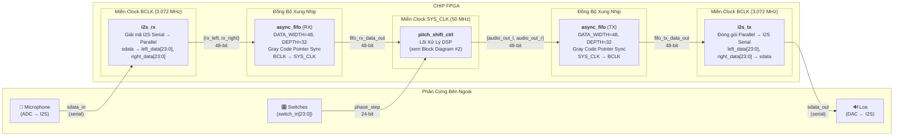
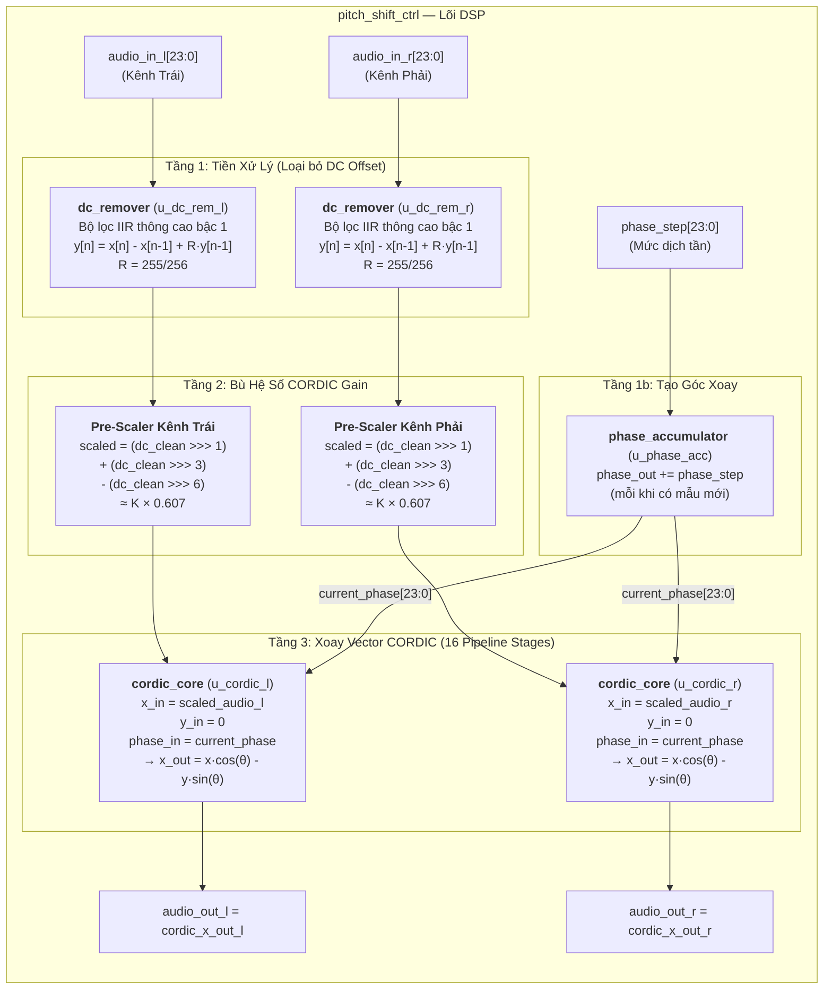
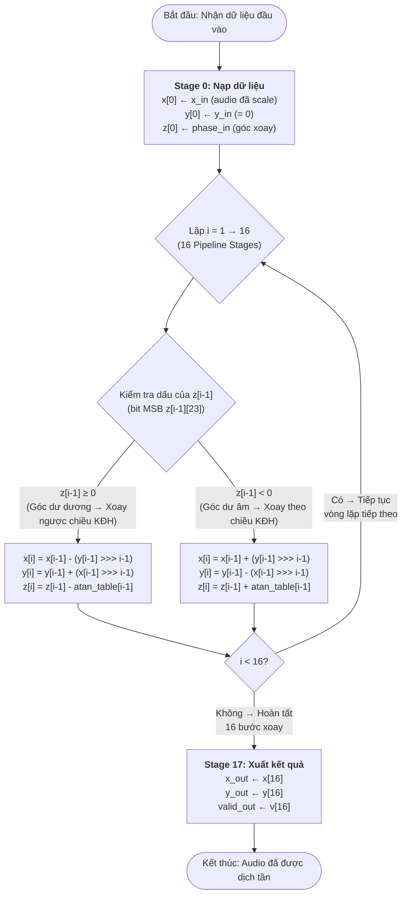
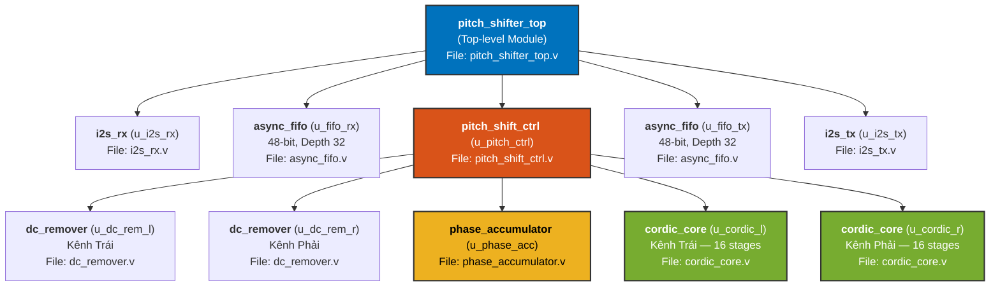

# Sơ Đồ Kỹ Thuật — Dự Án FPGA Voice/Frequency Transformer
> Tất cả sơ đồ dưới đây phản ánh chính xác code Verilog trong thư mục `rtl/`.
> Copy mã Mermaid vào **[mermaid.live](https://mermaid.live/)** → Bấm nút tải ảnh PNG → Dán vào Word/PowerPoint.

---

## 1. Block Diagram — Kiến Trúc Hệ Thống Tổng Thể (pitch_shifter_top.v)

Sơ đồ này cho thấy toàn bộ đường đi của tín hiệu âm thanh từ lúc đi vào chip FPGA đến lúc đi ra loa, trải qua 5 tầng xử lý. Hai miền xung nhịp (Clock Domain) được phân tách rõ ràng bằng cặp FIFO bất đồng bộ.

---

## 2. Block Diagram — Lõi Xử Lý DSP (pitch_shift_ctrl.v)

Sơ đồ này zoom vào bên trong module `pitch_shift_ctrl`, thể hiện chính xác cách tín hiệu âm thanh Stereo (2 kênh Trái/Phải) được xử lý song song qua 4 tầng pipeline.

---

## 3. Flowchart — Thuật Toán CORDIC Rotation (cordic_core.v)

Lưu đồ này mô tả chính xác 16 bước xoay vector bên trong module `cordic_core`. Mỗi bước chỉ sử dụng phép Cộng, Trừ và Dịch bit (Shift) — hoàn toàn không cần bộ nhân phần cứng (DSP Multiplier).

---

## 4. Module Hierarchy — Cấu Trúc Phân Cấp File RTL

Sơ đồ cây (tree) thể hiện quan hệ cha-con giữa các module Verilog. Dấu `×2` nghĩa là module đó được gọi (instantiate) 2 lần.

---

## Bảng Tổng Hợp Module

| # | Module | File | Chức năng | Miền Clock | Số Instance |
|---|--------|------|-----------|------------|-------------|
| 1 | `pitch_shifter_top` | pitch_shifter_top.v | Khung chính kết nối toàn bộ hệ thống | — | 1 |
| 2 | `i2s_rx` | i2s_rx.v | Giải mã tín hiệu I2S Serial → 24-bit Parallel | BCLK | 1 |
| 3 | `async_fifo` | async_fifo.v | Bộ đệm FIFO bất đồng bộ (Gray Code Sync) | BCLK ↔ SYS | 2 |
| 4 | `pitch_shift_ctrl` | pitch_shift_ctrl.v | Điều phối lõi DSP: DC Remove → Scale → CORDIC | SYS_CLK | 1 |
| 5 | `dc_remover` | dc_remover.v | Bộ lọc thông cao IIR bậc 1 (R = 255/256) | SYS_CLK | 2 |
| 6 | `phase_accumulator` | phase_accumulator.v | Tích lũy pha tuyến tính (NCO) | SYS_CLK | 1 |
| 7 | `cordic_core` | cordic_core.v | Xoay vector 16-stage pipeline (Rotation Mode) | SYS_CLK | 2 |
| 8 | `i2s_tx` | i2s_tx.v | Đóng gói 24-bit Parallel → I2S Serial | BCLK | 1 |
| | | | | **Tổng Instances** | **10** |
